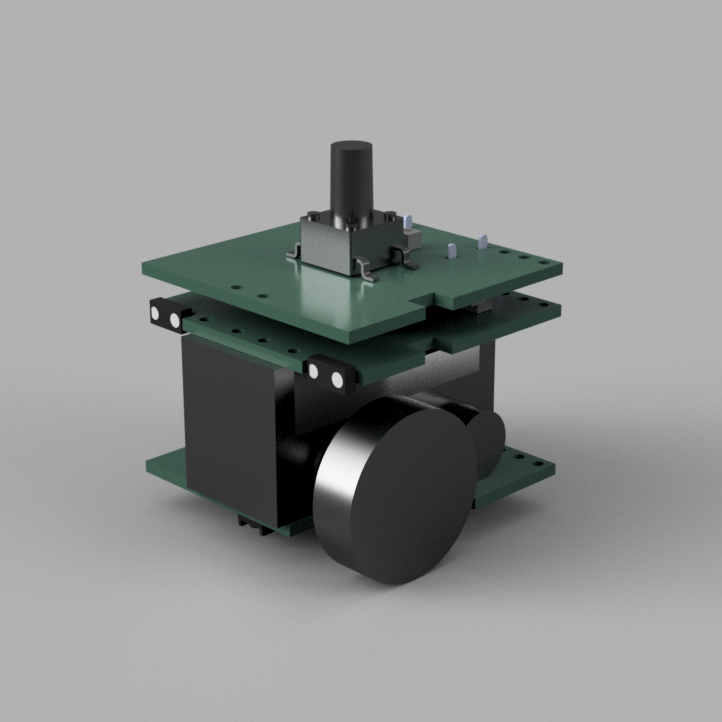
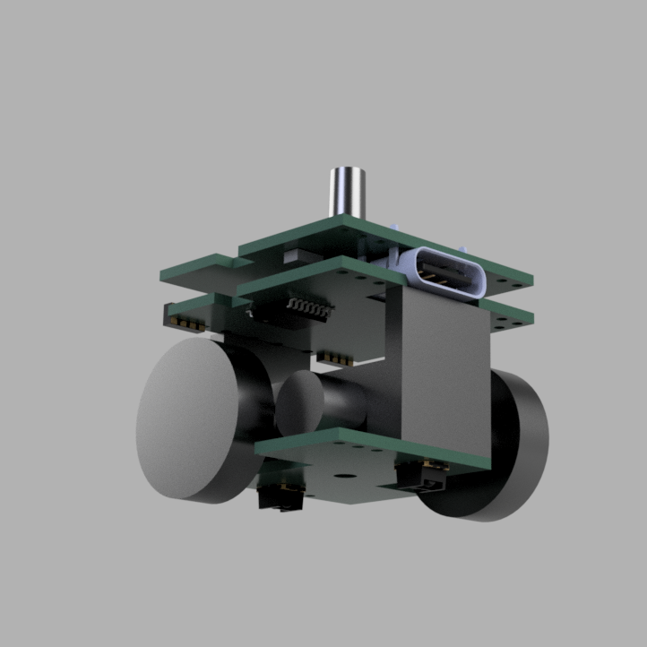
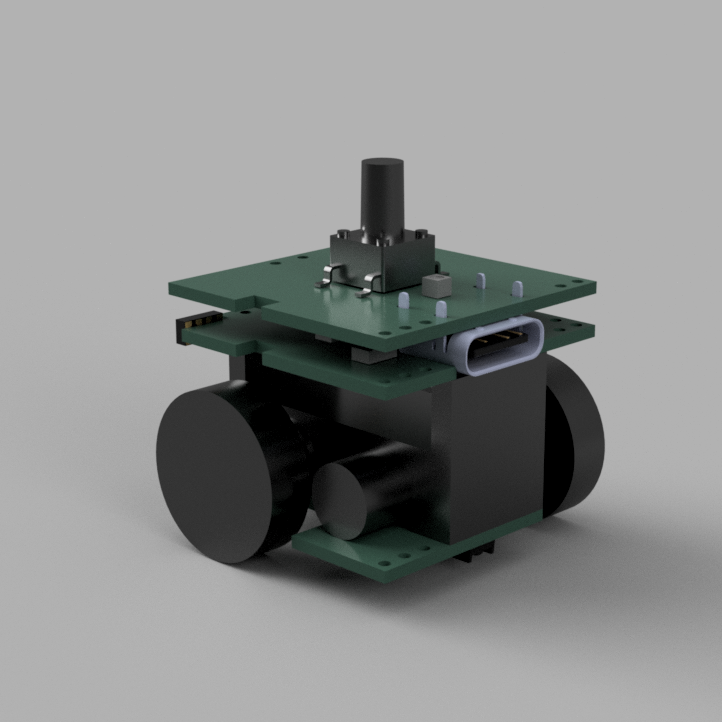
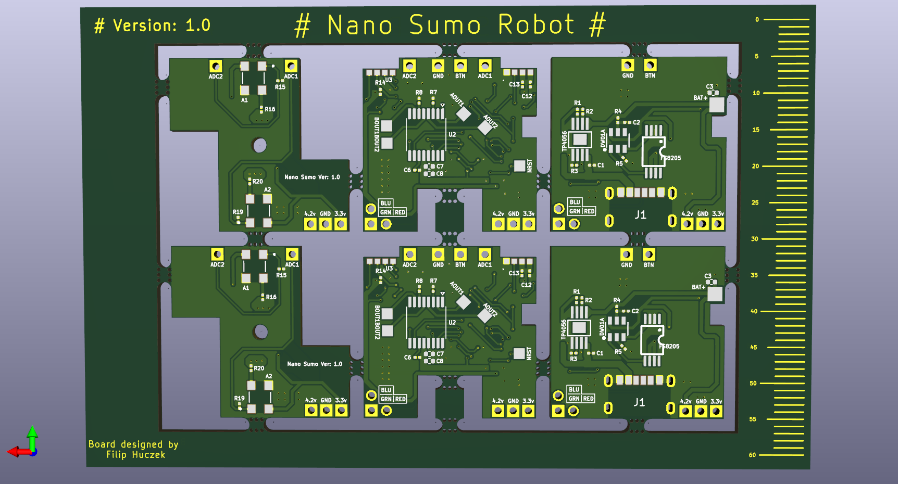
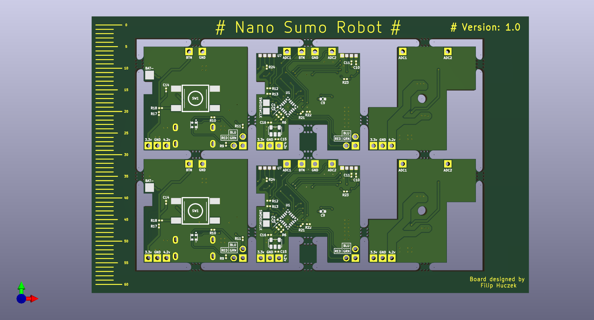
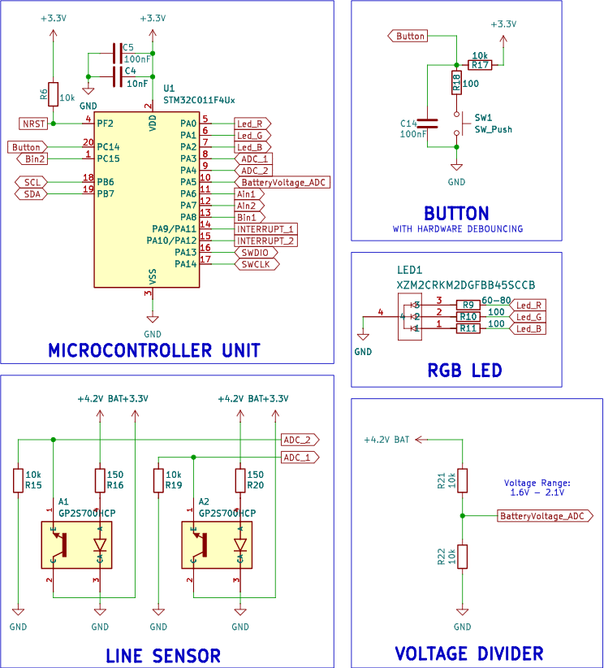
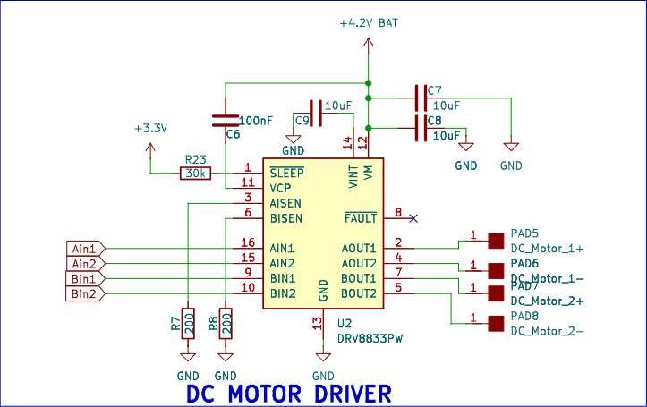
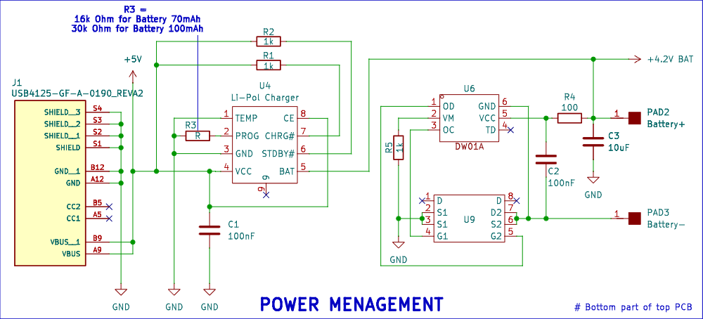
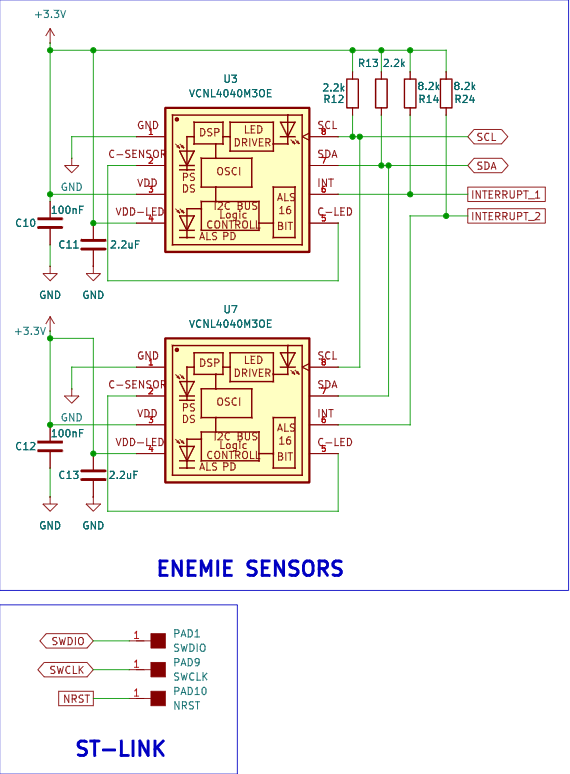
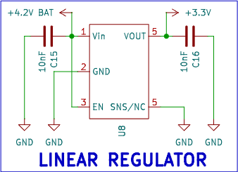

## 
Nano sumo fighting robots

 

A robot designed and built as an interactive showcase for a student research group. The set includes two robots in different colors, programmed to detect their opponent using sensors and push them out of the play area. The arena is defined by a special mat or a highly visible tape.
The project is built using three custom-designed PCBs that I developed. These boards integrate a battery management system, an STM32 microcontroller, an LED with a control button, a motor driver, two micro motors, and four optical sensors that detect both the opponent’s position and the boundary lines of the play area.
 

### Below are images of the PCB and schematics of the individual modules.

### Schematics

### All files are available in repository.
